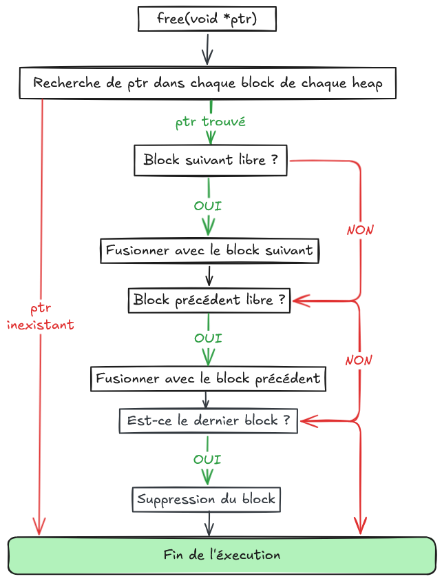
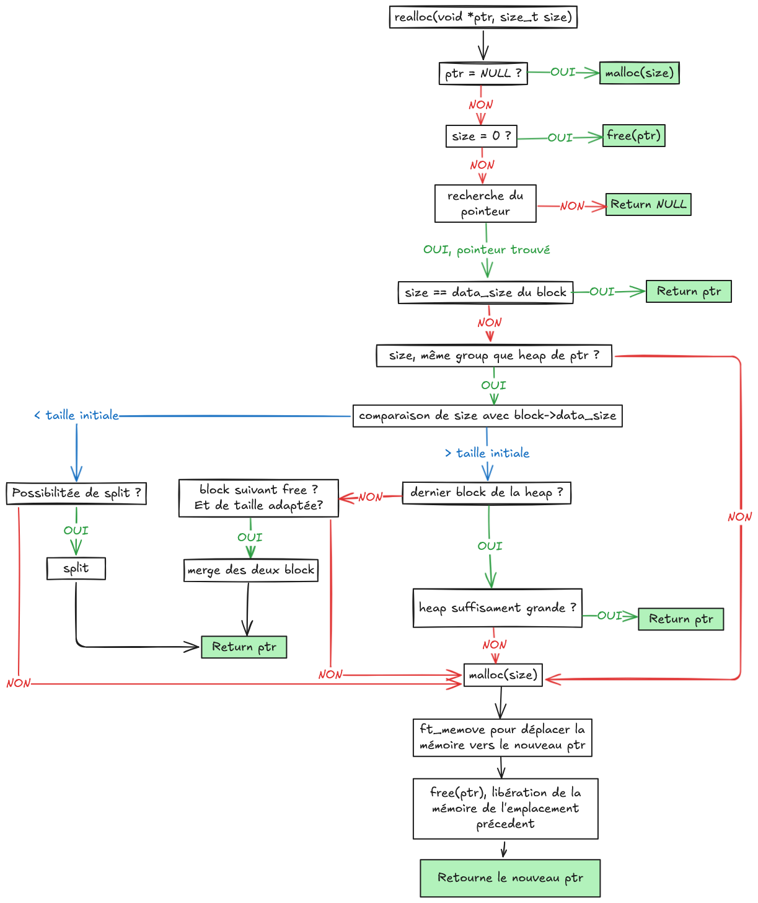

# malloc

# Sujet

### Instructions générales

- Ce projet sera corrigé uniquement par des humains. Vous êtes autorisé à organiser et nommer vos fichiers comme vous le souhaitez, mais vous devez respecter les règles suivantes :
- La bibliothèque doit être nommée **libft_malloc_$HOSTTYPE.so**.
- Un **Makefile** ou équivalent doit compiler le projet et contenir les règles habituelles. Il doit recompiler et re-lier le programme uniquement si nécessaire.
- Votre Makefile devra vérifier l’existence de la variable d’environnement **$HOSTTYPE**. Si elle est vide ou inexistante, il faudra lui assigner la valeur suivante :`uname -m`_`uname -s`
    
    ```bash
    ifeq ($(HOSTTYPE),)
    HOSTTYPE := $(shell uname -m)_$(shell uname -s)
    endif
    ```
    

Votre Makefile devra créer un lien symbolique **libft_malloc.so** pointant vers **libft_malloc_$HOSTTYPE.so**. Par exemple :

```bash
libft_malloc.so -> libft_malloc_intel-mac.so
```

- Si vous êtes malin, vous utiliserez votre bibliothèque pour votre malloc.
- Vous devez également soumettre votre dossier **libft** incluant son propre Makefile à la racine de votre dépôt. Votre Makefile devra compiler la bibliothèque, puis compiler votre projet.
- Vous êtes autorisé à utiliser **une variable globale** pour gérer vos allocations et **une variable globale** pour la gestion du thread-safe.
- Votre projet doit être du **code propre** : même sans norme stricte, si c’est moche vous aurez **0**.
- Vous devez gérer les erreurs avec soin. En aucun cas vos fonctions ne doivent provoquer de **comportement indéfini** ou de **segfault**.
- Dans la partie obligatoire, vous êtes autorisé à utiliser uniquement les fonctions suivantes :
    - `mmap(2)`
    - `munmap(2)`
    - `getpagesize` sous OSX ou `sysconf(_SC_PAGESIZE)` sous Linux
    - `getrlimit(2)`
    - Les fonctions autorisées dans votre **libft** (exemple : `write(2)`)
    - Les fonctions de **libpthread**
- Vous êtes autorisé à utiliser d’autres fonctions pour la partie bonus, tant que leur utilisation est justifiée lors de votre soutenance. Soyez intelligents !
- Vous pouvez poser vos questions sur le forum, sur Slack, etc.

### Partie obligatoire

Ce mini-projet consiste à écrire une bibliothèque de gestion de la mémoire dynamique.

Afin que vous puissiez l’utiliser avec des programmes déjà existants sans les modifier ni les recompiler, vous devez réécrire les fonctions de la libc suivantes : **malloc(3)**, **free(3)** et **realloc(3)**.

Vos fonctions devront être prototypées comme les fonctions système :

```c
#include <stdlib.h>
void free(void *ptr);
void *malloc(size_t size);
void *realloc(void *ptr, size_t size);
```

- La fonction **malloc()** alloue `size` octets de mémoire et retourne un pointeur vers cette mémoire allouée.
- La fonction **realloc()** tente de changer la taille de l’allocation pointée par `ptr` à `size`, et retourne `ptr`.
    
    Si l’espace n’est pas suffisant pour agrandir l’allocation, `realloc()` crée une nouvelle allocation, copie autant de données que possible depuis `ptr` vers la nouvelle zone, libère l’ancienne allocation, et retourne un pointeur vers la mémoire nouvellement allouée.
    
- La fonction **free()** désalloue la mémoire pointée par `ptr`. Si `ptr` est `NULL`, aucune opération n’est effectuée.
- En cas d’erreur, **malloc()** et **realloc()** doivent retourner un pointeur `NULL`.
- Vous devez utiliser uniquement les appels systèmes **mmap(2)** et **munmap(2)** pour réclamer ou libérer de la mémoire au système.
- Vous devez gérer vos propres allocations internes sans utiliser le **malloc** de la libc.
- Pour des raisons de performances, vous devez limiter le nombre d’appels à **mmap()** et **munmap()**. Vous devez donc **pré-allouer** certaines zones mémoire pour stocker vos allocations **petites** et **moyennes**.
- La taille de ces zones doit être un multiple de `getpagesize()` sous OSX ou `sysconf(_SC_PAGESIZE)` sous Linux.
- Chaque zone doit contenir au minimum **100 allocations** :
    - Les allocations **TINY** (de 1 à *n* octets) seront stockées dans des zones de *N* octets.
    - Les allocations **SMALL** (de *n+1* à *m* octets) seront stockées dans des zones de *M* octets.
    - Les allocations **LARGE** (*m+1* octets et plus) seront allouées hors des zones, c’est-à-dire directement avec **mmap()**, chacune dans sa propre zone.
    
- C’est à vous de définir les valeurs de **n, m, N, M** pour trouver un bon compromis entre **vitesse** (réduction des appels système) et **économie de mémoire**.

Vous devez également écrire une fonction permettant de visualiser l’état des zones mémoire allouées. Elle doit être prototypée ainsi :

```c
void show_alloc_mem();
```

L’affichage doit être trié par adresses croissantes, avec le format suivant :

```c
TINY : 0xA0000
0xA0020 - 0xA004A : 42 bytes
0xA006A - 0xA00BE : 84 bytes
SMALL : 0xAD000
0xAD020 - 0xADEAD : 3725 bytes
LARGE : 0xB0000
0xB0020 - 0xBBEEF : 48847 bytes
Total : 52698 bytes
```

Vous devez également **aligner la mémoire** donnée par votre malloc.

### Partie Bonus

Voici le premier bonus de ce sujet :

- Gérez l'utilisation de votre malloc dans un programme multithread (afin d'être « thread safe » en utilisant la bibliothèque pthread).

Afin d'obtenir le score maximum, vous devez implémenter certaines fonctions supplémentaires (liste non exhaustive) telles que :

- Gérez les variables d'environnement de débogage malloc. Vous pouvez imiter celles du système malloc ou inventer les vôtres.
- Créer une fonction show_alloc_mem_ex() qui affiche plus de détails, par exemple, un historique des allocations ou un vidage hexadécimal des zones allouées.
- « Défragmenter » la mémoire libérée.

# Remarques concernant le sujet

### Qu’est-ce qu’un fichier .so ?

Un fichier **`.so`** (pour *shared object*) contient du code et des données pouvant être partagés entre plusieurs programmes. Contrairement aux bibliothèques statiques **`.a`**, dont le contenu est copié directement dans chaque exécutable lors de la compilation, une bibliothèque **dynamique** (`.so`) est simplement **référencée** par le programme au moment de l’exécution. Cela permet d’économiser de la mémoire et de mettre à jour une bibliothèque sans recompiler les programmes qui l’utilisent.

### Pourquoi faut il utiliser des threads ?

L’utilisation des **threads** est requise pour le bonus, afin de rendre les fonctions `malloc`, `free` et `realloc` **thread-safe**.

En effet, la **heap** (le tas mémoire du processus) est **partagée entre tous les threads** d’un même processus. Si plusieurs threads appellent `malloc` ou `free` simultanément sans protection, ils peuvent modifier les structures internes de gestion mémoire en même temps, provoquant ainsi une **corruption de la mémoire**.

Pour éviter cela, on utilise un **mutex** (verrou) afin de garantir qu’un seul thread à la fois puisse manipuler la heap.

> 💡 Note : les threads partagent la même mémoire, contrairement aux processus qui ont chacun leur propre espace mémoire.
> 

### Pourquoi faut il utiliser une variable globale ?

Une variable globale est nécessaire pour mémoriser l’adresse de la heap principale et suivre son état entre plusieurs appels à malloc, free et realloc. Sans cette variable, chaque appel à malloc ignorerait les précédentes allocations, empêchant ainsi toute gestion cohérente de la mémoire. La variable globale agit donc comme un point d’entrée central vers la structure de données interne qui représente la heap.

### Pourquoi pré-allouer des heap TINY ou SMALL ?

Comme indiqué dans le sujet, les zones TINY et SMALL servent à réduire le nombre d’appels système (`mmap / munmap`), qui sont coûteux en temps.

En effet, mmap alloue la mémoire par pages, généralement de 4096 octets. Si chaque petit malloc (`malloc(4)` par exemple) appelait directement `mmap`, cela gaspillerait énormément de mémoire (4096 octets alloués pour seulement 4 utiles) et ralentirait fortement le programme.

En regroupant plusieurs petites allocations dans des zones pré-allouées (TINY ou SMALL), on diminue les appels système. Cela améliore les performances globales du malloc.

# Comment fonctionnent malloc, free et realloc?

## Malloc

```c
void *malloc (size_t size)
```

### La gestion des heap

La gestion de la heap repose sur l’utilisation de listes chaînées. Chaque heap (zone mémoire allouée via mmap) est reliée à la précédente et à la suivante par une liste doublement chaînée, décrite par la structure suivante :

```c
typedef struct s_heap
{
    struct s_heap   *prev;
		struct s_heap   *next;
    t_heap_group    group;
		size_t          total_size;    // Taille totale de la heap    
		size_t          free_size;     // Espace de la heap qui n'appartient à aucun block (free ou pas !)    
		size_t          block_count;   // Nombre de block dans la heap
}
```

Cette structure prend 48 octets en mémoire. Chaque structure `t_heap` est placée **au tout début de la zone mémoire** obtenue par `mmap`.

Juste après cette structure se trouvent les métadonnées du **premier block** :

```c
typedef struct s_block
{    
		struct s_block  *prev;    
		struct s_block  *next;
		size_t          data_size;     // Taille des données que dois pouvoir contenir le block
		t_bool          is_free;       // FALSE : block alloué / TRUE : block non alloué
}               t_block;
```

Chaque heap contient donc une **liste chaînée de blocks**, où chaque block représente une zone allouée ou libérée à l’intérieur de cette heap. Cette structure a une taille de 32 octets.

Voici un schéma représentatif de la structure de notre heap :


Chaque heap contient donc une **liste chaînée de blocks**, où chaque block représente une zone allouée ou libérée à l’intérieur de cette heap.

Les heaps sont classées en trois catégories, selon la taille des allocations qu’elles contiennent :

- TINY : pour les blocks de 1 à 128 octets
- SMALL : pour les blocks de 129 à 1024 octets
- LARGE : pour les blocks de plus de 1024 octets

Les heaps TINY et SMALL sont pré-allouées et peuvent contenir plusieurs blocks, tandis que chaque heap LARGE est allouée séparément, directement via mmap, pour une seule demande.

### Etapes du fonctionnement

Lorsqu’un appel à `malloc(size)` est effectué :

1. On détermine le **type de heap** (TINY, SMALL ou LARGE) en fonction de la taille demandée.
2. On recherche une heap existante correspondant à ce type.
3. Dans cette heap, on cherche un **block libre** suffisamment grand.
4. Si aucun block libre n’est trouvé mais qu’il reste de la place dans la heap, on crée un **nouveau block** à la fin.
5. Si la heap n’a plus d’espace disponible, on **crée une nouvelle heap** via `mmap` et on y place le block.

### Schéma du fonctionnement


### Structure du code


### Cas particulier : malloc(0)

Le comportement standard de malloc(0) dépend des implémentations, mais la plupart retournent un pointeur unique et non nul, qui ne peut pas être utilisé pour accéder à la mémoire. Dans notre implémentation, pour simplifier la gestion interne, malloc(0) retourne simplement NULL, indiquant qu’aucune allocation n’a été effectuée.

### Le cas particulier de l’allocation LARGE :

Lorsqu’une demande dépasse la borne SMALL (> 1024 octets), l’allocation est traitée comme LARGE. Dans ce cas :

- On crée une nouvelle heap dédiée via mmap (une zone indépendante, non partagée avec TINY/SMALL).
- La taille réellement mappée est arrondie au multiple de la taille de page (souvent 4096 octets), conformément à getpagesize()/sysconf(_SC_PAGESIZE).
- La zone contient, dans cet ordre :
    1. les métadonnées de heap (t_heap),
    2. les métadonnées de block (t_block),
    3. la zone utilisateur (taille demandée alignée au multiple de 16 supérieur)

Important : on demande à mmap la taille sizeof(t_heap) + sizeof(t_block) + align(size, 16), puis on arrondit à la page. On n’expose que size (alignée) à l’utilisateur ; le surplus dû à l’arrondi n’est pas de la mémoire utilisable par l’appelant (même si elle est mappée dans la heap).

Exemple (illustratif) :

- size = 1025 octets → align(1025, 16) = 1040 octets
- Les métadonnées : sizeof(t_heap) + sizeof(t_block) = 80 octets
- Taille brute demandée : 80 + 1040 = 1120 → arrondi à 4096 (si page = 4096)
- Mémoire utilisable par l’utilisateur : 1040 octets (pas 4096 − 80). Le reste de la page est du padding interne propre à cette heap LARGE.

Il reste pas 4016 octets dont 1040 sont pour l’utilisateur. L’utilisateur ne doit utiliser que la taille demandée (arrondie à l’alignement), ici 1040. Le surplus vient de l’arrondi par pages et reste interne (pas garanti stable ni réutilisé dans une LARGE).

Sécurité mémoire

- Accéder au-delà de data_size (alignée) est un comportement indéfini pour l’utilisateur, même si la page mappée est plus grande.
- Accéder au-delà de la zone mappée provoque typiquement une segmentation fault : le noyau interdit l’accès hors des limites mmap.

### L’alignement mémoire

L’alignement mémoire est un aspect essentiel de toute implémentation de malloc, car il garantit que les adresses retournées sont compatibles avec l’architecture du processeur et les types de données manipulés.

Pourquoi aligner la mémoire ?

Sur la plupart des architectures modernes, certaines instructions exigent que les données soient alignées sur une frontière spécifique (par exemple, 8 ou 16 octets). Une adresse mal alignée peut provoquer un ralentissement matériel, voire un crash sur certaines plateformes.

Principe appliqué

Dans notre implémentation, toute allocation est arrondie au multiple de 16 supérieur à la taille demandée.
Cela signifie que si un utilisateur demande 37 octets, le bloc alloué fera en réalité :

```c
# define BLOCK_MIN_SIZE 16
size_alloc = round_nearest_multiple(size, BLOCK_MIN_SIZE);
```

Ainsi, **tous les blocs** renvoyés par `malloc` commencent sur une **adresse multiple de 16**, ce qui garantit un alignement correct pour tout type de donnée

Exemple concret :

| Taille demandée | Taille alignée | Adresse retournée (exemple) |
| --- | --- | --- |
| 4 octets | 16 octets | 0x1000 |
| 37 octets | 48 octets | 0x1030 |
| 129 octets | 144 octets | 0x10C0 |

Cet arrondi a deux avantages :

1. Il **simplifie** la gestion des blocs en garantissant que chaque structure commence à une adresse alignée.
2. Il **évite les fautes d’alignement** (undefined behavior) lorsque l’utilisateur cast un pointeur `void*` vers n’importe quel autre type.

L’inconvénient est un léger **gaspillage mémoire** pour les petites allocations, mais il est largement compensé par la sécurité et la stabilité du système.

## Free

La fonction free() est chargée de libérer un bloc de mémoire précédemment alloué par malloc() ou realloc(). Son rôle est de marquer ce bloc comme disponible à la réutilisation, et, si possible, de fusionner les zones libres adjacentes pour éviter la fragmentation. Voici son prototype :

```c
void free(void *ptr)
```

### Etapes du fonctionnement

1. **Cas particulier : `free(NULL)`  :** Si le pointeur passé à `free()` est `NULL`, la fonction ne fait rien. Ce comportement simplifie l’usage de `free`.
2. **Vérification du pointeur :** On s’assure que le pointeur correspond bien à un bloc appartenant à l’une de nos heaps internes. Si ce n’est pas le cas (pointeur corrompu ou double free), aucune opération n’est effectuée.
3. **Libération du bloc :** Le champ `is_free` du bloc est mis à `TRUE`, indiquant qu’il est désormais libre.
4. **Fusion des blocs adjacents libres :** Si les blocs voisins (précédent ou suivant) sont également libres, ils sont **fusionnés** en un seul bloc plus grand. Cette étape limite la **fragmentation interne**, c’est-à-dire la perte d’espace due à de multiples petits blocs libres.
5. **Nettoyage de la heap**
    - Si le bloc libéré est le **dernier de sa heap**, il est supprimé.
    - Si la heap devient complètement vide (tous ses blocs sont libres), elle est **désallouée intégralement** via `munmap()`.

> ATTENTION !!! Dans le code, la heap n’est PAS supprimée lorsqu’elle est vide ! Il ne faut supprimer les heaps que lorsque getrlimit est atteint ! J’ai négligé ce point lors du projet. C’est une erreur à ne pas reproduire !
> 

### Schéma du fonctionnement



## Realloc :

La fonction realloc() permet de modifier la taille d’un bloc de mémoire déjà alloué. Dans cette implémentation, son comportement est volontairement simplifié, tout en restant conforme à la spécification standard. Elle ne tente pas de redimensionner le bloc « en place » : lorsqu’une nouvelle taille est demandée, elle effectue une nouvelle allocation, copie les données, puis libère l’ancienne zone.

Son prototype est :

```c
void *realloc(void *ptr, size_t size);
```

### Étapes du fonctionnement

- **Cas `ptr == NULL`** : Si le pointeur est nul, l’appel est équivalent à : `malloc(size)`;
- **Cas `size == 0` et `ptr != NUL`**: Dans ce cas, le bloc est libéré. L’appel est équivalent à `free(ptr)`;
- **Cas général (redimensionnement)** -> cf schéma
### Schema du fonctionnement



# Show_alloc_mem

La fonction show_alloc_mem() est un outil de diagnostic permettant de visualiser l’état actuel des zones mémoire gérées par notre malloc. Elle affiche toutes les allocations en cours, triées par adresses croissantes, et indique la taille de chaque bloc ainsi que le total alloué. Son prototype est :

```c
void show_alloc_mem(void);
```

L’objectif de `show_alloc_mem()` est de parcourir **toutes les heaps (TINY, SMALL, LARGE)** et d’afficher ceci dans le terminal :

```bash
TINY : 0xA0000
0xA0020 - 0xA004A : 42 bytes
0xA006A - 0xA00BE : 84 bytes
SMALL : 0xAD000
0xAD020 - 0xADEAD : 3725 bytes
LARGE : 0xB0000
0xB0020 - 0xBBEEF : 48847 bytes
Total : 52698 bytes
```

### Etapes du fonctionnement

1. La fonction commence par parcourir la **liste globale des heaps**, depuis la heap TINY jusqu’à la dernière heap LARGE.
2. Pour chaque heap :
    - On affiche son **type** et son **adresse de base**.
    - On parcourt la **liste chaînée de blocs** associée.
    - On affiche uniquement les **blocs non libres (`is_free == FALSE`)**.
3. Une variable interne maintient un **compteur global** de la mémoire utilisée.
4. À la fin, la somme totale est affichée à la ligne `Total : ... bytes`.

### Structure du code


# BONUS : Rendre malloc thread-safe

Contrairement à des processus distincts (qui ont chacun leur propre espace mémoire), les threads d’un même processus partagent la même heap.
Cela signifie que si le thread A modifie la liste des blocs (par exemple en allouant un bloc),  et que thread B fait de même au même moment, leurs modifications risquent d’entrer en collision, ce qui peut entraîner une corruption totale du tas. Pour éviter ce problème, on entoure nos fonctions par un verrou (`pthread_mutex_t`). Ce verrou garantit qu’un seul thread à la fois peut manipuler la structure de la heap.

### Exemple de corruption du tas d’un malloc non thread-safe

Voici un exemple

Voici ce que l’on peut obtenir :

```c
#include <pthread.h>
#include "inc/malloc.h"

void *routine(void *value)
{    
	size_t v = *((size_t *)value);    
	void *ptr = malloc(12);    
	ft_putstr_fd("routine = ",1);    
	ft_putnb_hex((uintptr_t) ptr);    
	ft_putstr_fd(" ",1);    
	ft_putsize_t(v);    
	write(1, "\n", 1);    
	return ptr;
}
int main()
{    
	pthread_t   tid1;    
	pthread_t   tid2;
	
	size_t  thread_1;    
	size_t  thread_2;
	    
	thread_1 = 1;    
	thread_2 = 2;
	    
	pthread_create(&tid1, NULL, routine, &thread_1);    
	pthread_create(&tid2, NULL, routine, &thread_2);
	    
	pthread_join(tid1, NULL);    pthread_join(tid2, NULL);
	    
	show_alloc_mem();
	    
	return 0;
}
```

```bash
routine = routine = 0x0x7733447755996689f8005500  21

TINY : 0x734759698000
0x734759698050 - 0x734759698060 : 16 bytes (FALSE)
TINY : 0x73475968f000
0x73475968f050 - 0x73475968f060 : 16 bytes (FALSE)
Total : 32 bytes
```

On observe que 2 heap ont été créées ! Alors qu’une seule et même heap permettait de stocker les 2 blocks mémoires demandés. Les règles fixées au départ sont violées. 

### La solution

Pour régler ce problème nous allons utiliser la seconde variable globale autorisée par le sujet. Cette variable contient un mutex qui sera lock au début de l‘exécution des fonction malloc, free et show_alloc_mem. ou realloc. Pour l’initialisation de cette variable, j’utilise la macro PTHREAD_MUTEX_INITIALIZER. Ainsi, même si plusieurs threads appellent `malloc` simultanément, leurs exécutions seront **séquentielles** à l’intérieur de la section critique.

Voici la sécurisation de la fonction malloc dans le code :

```c
void *malloc (size_t size)
{    
		pthread_mutex_lock(&mt_protect);         // Lock du mutex
		void *ptr = execute_malloc(size);        // Execution de l'algorithme malloc
    pthread_mutex_unlock(&mt_protect);       // Unlock du mutex
		return ptr;                              // return du pointeur 
}
```

### Pourquoi utiliser PTHREAD_MUTEX_INITIALIZER au lieu de pthread_mutex_init ?

La macro `PTHREAD_MUTEX_INITIALIZER` permet d’initialiser **statiquement** un mutex global au moment du chargement du programme. Cela évite d’avoir à appeler explicitement `pthread_mutex_init()` lors du premier appel à `malloc`.

Cette méthode est :

- **plus simple** (aucune initialisation dynamique à gérer),
- **plus sûre** (pas de risque d’initialisation multiple par différents threads),
- et **immédiatement prête à l’emploi** dès le chargement de la bibliothèque `.so`.

### Pourquoi le mutex n’est jamais détruit ?

Dans un programme standard, on détruit un mutex avec `pthread_mutex_destroy()` à la fin. Cependant, dans une bibliothèque comme notre `malloc`, il est **dangereux** de le faire :

- Le système ou la libc peuvent encore appeler `malloc` pendant la phase de sortie du programme (via des destructeurs ou `atexit()`).
- Si le mutex est détruit trop tôt, tout appel ultérieur à `malloc` provoquerait un **comportement indéfini**.

C’est pourquoi notre implémentation **ne détruit jamais explicitement le mutex,** le système d’exploitation s’en charge automatiquement à la fin du processus.

### Pourquoi avoir recodé calloc() ?

Lors des tests en contexte **multithread**, j’ai constaté que certaines fonctions de la bibliothèque **pthread** (par exemple `pthread_create()`) utilisaient **`calloc()`** en interne, plutôt que `malloc()`.

Cela posait un problème même en chargeant notre bibliothèque via `export LD_LIBRARY_PATH=$PWD` et `export LD_PRELOAD=$PWD/libft_malloc.so` .

les appels à `calloc()` n’étaient **pas redirigés** vers notre implémentation, mais continuaient à utiliser **le `calloc` du système**.

En effet, la fonction `calloc()` de la libc ne fait pas toujours appel à `malloc()` en interne ou le fait autrement qu’avec le symbole `malloc(size)`. Sur certaines plateformes, elle peut utiliser des **mécanismes internes** de la libc, non interceptés par le `LD_PRELOAD`. Du coup les threads créés via `pthread_create()` appelaient le `calloc()` système au lieu du nôtre, contournant complètement notre gestion mémoire.

# Compilation et utilisation de la bibliothèque

## Etape 1 : Compiler la librairie grâce au Makefile

Contrairement à la plupart des projet 42, le makefile ne doit pas produire un executable mais une librairie partageable en .so appelée `libft_malloc_$[HOSTTYPE.so](http://hosttype.so/)`

Pour la compilation des fichier “.o” :

```bash
gcc -Wall -Wextra -Werror -fPIC -c fichier1.c fichier2.c -o fichier1.o fichier2.o -I chemin_vers_fichier_h
```

Pour la compilation de la librairie :

```bash
gcc -Wall -Wextra -Werror -shared fichier1.o fichier2.o -o nom_de_la_librairie
```

… ainsi qu’un lien symbolique vers cette librairie.

```bash
ln -s nom_de_la_librairie nom_du_lien_symbolique
```

## Etape 2 : Compiler un exécutable de test

Pour tester notre `malloc`, on compile un programme simple en **liant** notre bibliothèque :

```bash
gcc simple_test.c -I inc -L. -lft_malloc
```

`inc` : emplacement de malloc.h

## Etape 3 : Forcer l’utilisation de notre malloc

Par défaut, tous les programmes utilisent le **malloc de la libc**.

Pour rediriger les appels vers **notre implémentation**, on utilise deux variables d’environnement :

```bash
export LD_LIBRARY_PATH=$PWD
export LD_PRELOAD=$PWD/libft_malloc.so
```

- `LD_LIBRARY_PATH` indique où chercher les bibliothèques partagées.
- `LD_PRELOAD` force le chargement de notre bibliothèque avant toutes les autres (y compris la libc).

⚠️ **Attention :** ne pas exécuter ces commandes globalement dans le terminal, car elles affecteraient toutes les commandes (et la plupart cesseraient de fonctionner).

Pour une exécution sécurisée, il esr possible d’utiliser un script dans un fichier sh, par exemple run.sh:

```bash
#!/bin/sh
export LD_LIBRARY_PATH=$PWD
export LD_PRELOAD=$PWD/libft_malloc.so
$@
```

Ainsi la commande suivante permet de bypass le malloc par défaut uniquement pour notre executable de test.

```bash
sh run.sh ./a.out
```

Ce script applique le `LD_PRELOAD` **uniquement** pour le programme donné

## Commande récapitulative

Pendant tout le projet je testais mon code avec la commande suivante qui effectue les 3 etapes précedentes en une seule fois :

```bash
 make && gcc simple_test.c -I inc -L. -lft_malloc && sh run.sh valgrind --leak-check=full --show-leak-kinds=all --track-origins=yes ./a.out
```

## A propos des leaks

Il est possible d’utiliser Valgrind entant que chasseur de leaks. Pour cela il faut compiler l’executable de test avec les flags suivants :

```bash
gcc -g -O0 test.c
```

Et lancer l’exécutable avec cette commande :

```bash
 valgrind --leak-check=full --show-leak-kinds=all --track-origins=yes ./main
```

Cependant, il faut noter que Valgrind utilise lui-même des appels à `malloc` et `calloc`. Si notre `malloc` est activé via `LD_PRELOAD`, Valgrind peut se retrouver à **analyser son propre fonctionnement**, ce qui entraîne souvent des faux positifs ou des comportements inattendus.

> 💡 Pour des tests précis, il est donc recommandé de :
> 
> - exécuter Valgrind **sans** `LD_PRELOAD` pour tester le code utilisateur,
> - et avec `LD_PRELOAD` uniquement pour vérifier le comportement général du `malloc` (pas pour mesurer les leaks).

## Pour aller plus loin…

## malloc de Doug Lea

 Parmi les nombreuses implémentations existantes de `malloc`, celle de **Doug Lea** (aussi connue sous le nom de **dlmalloc**) est l’une des plus célèbres.

Elle repose sur un système de **chunks** (blocs mémoire) organisés en listes chaînées distinctes selon leur état :

- une liste pour les blocs **libres :**
    
    
    
- une autre pour les blocs **occupés :**
    
    
    

Ce modèle permet une recherche de bloc libre **plus rapide** grâce à des structures adaptées (bins triés par taille, par exemple). C’est une source précieuse pour comprendre comment la gestion mémoire est optimisée dans les implémentations réelles du `malloc` système.

## vmap

Pour observer concrètement comment un programme utilise la mémoire, la commande `vmmap` (ou `cat /proc/<pid>/maps` sous Linux) est extrêmement utile.

Considérons le code suivant :

```c
#include <stdio.h>
#include <sys/mman.h>

int main()
{
	printf("PID = %d\n", getpid());
	while (1)
	{}
	return 0;
}
```

Si je lance la commande `vmap <PID>`, voilà le résultat :

Il y plusieurs sections qui permettent de résumer l’utilisation de la mémoire par notre exécutable a.out :

```bash
Process:         a.out [15905]
Path:            /Users/USER/Documents/*/a.out
**Load Address:    0x103be5000**
Identifier:      a.out
Version:         ???
Code Type:       X86-64
Platform:        macOS
Parent Process:  zsh [5305]

Date/Time:       2024-07-06 15:09:07.340 +0200
Launch Time:     2024-07-06 15:08:56.432 +0200
OS Version:      macOS 12.7.2 (21G1974)
Report Version:  7
Analysis Tool:   /usr/bin/vmmap

Physical footprint:         316K
Physical footprint (peak):  316K
```

- `Load Address` correspond à l’adresse de l’espace virtuel à partir de laquelle se charge le processus. Le reste est assez explicit.
- La section `==== Non-writable regions for process 15905` est utilisée par l’OS pour l’execution du code.
- Le segement __TEXT contient les instructions machines compilées exécutées par le CPU. Ces données peuvent être lues et éxécutées.
- Le segment __DATA_CONST : c’est ici que sont stockées les variables constantes développées dans le programme. Elle ne peuvent que lu, jamais éxécuté ni modifié.
- Le __LINKEDIT segment : ces information sont utilisés par le linker (?)

# Sources

[Virtual Address Space in Operating System - GeeksforGeeks](https://www.geeksforgeeks.org/virtual-address-space-in-operating-system/)

[Virtual Memory in Operating System - GeeksforGeeks](https://www.geeksforgeeks.org/virtual-memory-in-operating-system/)

[mmap() — Map pages of memory](https://www.ibm.com/docs/en/zos/2.4.0?topic=functions-mmap-map-pages-memory)

[Memory Mapping - GeeksforGeeks](https://www.geeksforgeeks.org/memory-mapping/)

[Difference between mmap and malloc](http://www.differencebetween.net/technology/hardware-technology/difference-between-mmap-and-malloc/)

[malloc vs mmap in C](https://stackoverflow.com/questions/1739296/malloc-vs-mmap-in-c)

[Memory Mapped Files in OS - GeeksforGeeks](https://www.geeksforgeeks.org/memory-mapped-files-in-os/)

[What is Demand Paging in Operating System? - GeeksforGeeks](https://www.geeksforgeeks.org/what-is-demand-paging-in-operating-system/)

[https://blog.antoninhrlt.com/how-to-rewrite-malloc-from-scratch-with-c](https://blog.antoninhrlt.com/how-to-rewrite-malloc-from-scratch-with-c)

[cw.fel.cvut.cz](https://cw.fel.cvut.cz/old/_media/courses/a4m33pal/04_dynamic_memory_v6.pdf)

[How to create your own malloc library](https://medium.com/a-42-journey/how-to-create-your-own-malloc-library-b86fedd39b96)

[With the help of the examples that you also provide, what are the first fit, next fit and best fit algorithms for memory management?](https://www.quora.com/With-the-help-of-the-examples-that-you-also-provide-what-are-the-first-fit-next-fit-and-best-fit-algorithms-for-memory-management/answer/Varun-Agrawal-1)

[Memory management : Writing own malloc()](https://medium.com/@geekgirldecodes/memory-management-writing-own-malloc-4cfc4ebf5b92)

[Malloc from Scratch: Diving into Memory's Secret Keeper](https://c2s2-engineering-cornell-edu.translate.goog/blogposts/FA23/MallocFromScratch?_x_tr_sl=en&_x_tr_tl=fr&_x_tr_hl=fr&_x_tr_pto=rq)

[Master memory management, I built my own malloc, and you should too](https://www.jterrazz.com/articles/1-master-memory-management-i-built-my-own-malloc-and-you-should-too)

[Variables locales, globales et statiques en C - codequoi](https://www.codequoi.com/variables-locales-globales-statiques-en-c/#variables-globales)

## A propos de la compilation en C

[www.iiti.ac.in](https://www.iiti.ac.in/people/~ayanm/courses/autumn_2022/CS353/Lab3.pdf)

[How to use a library with headers and .so files?](https://stackoverflow.com/questions/31176747/how-to-use-a-library-with-headers-and-so-files)

[Create a symbolic link in Unix](https://kb.iu.edu/d/abbe)

[What's the difference between := and = in Makefile?](https://stackoverflow.com/questions/4879592/whats-the-difference-between-and-in-makefile)
